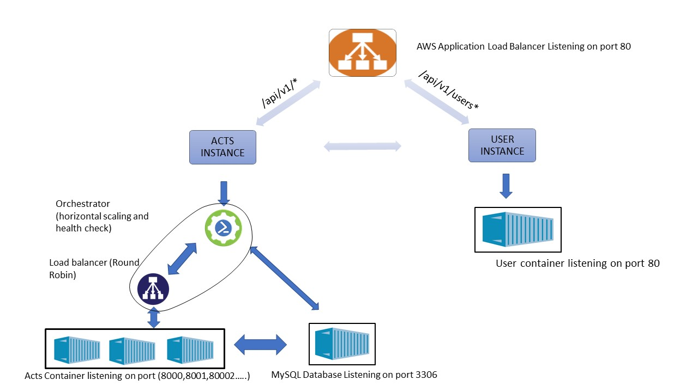

# Description
The project was carried out as a part of the Cloud Computing course at PES University 2019.<br/>
The objective of the project was to build a container orchestrator that can perform load balancing between micro-services and within micro-services, fault tolerance, and auto-scaling. The entire project was implemented on [Amazon AWS](https://aws.amazon.com/) EC2 instances.


# Requirements
* ubuntu 16.04 
* python3
* flask
* mysql
* docker 
* alpine 3.7

# Architecture 
The overall architecutre of the  project looks something like the one given below

# Usage 
To replicate the project execute the below given steps in order'
* clone the repository
```
$git clone https://github.com/SKsaqlain/SelfieLessActs.git
```
* Create two ece2 instances one for the user micro-service and the other for the acts micro-service name the key file for the user instance as _users_ and the acts instance as _acts_ (_for ease of replication only_).<br/> follow the below link to create a AWS EC2 instance. configure the security group to allow http,ssh traffic and tcp port 80.
```
https://docs.aws.amazon.com/efs/latest/ug/gs-step-one-create-ec2-resources.html
```
* Install Docker on both the instances.<br/> Follow the below link to install docker on both the instances
```
https://docs.docker.com/install/linux/docker-ce/ubuntu/
```
* Push the docker file from your local host to the both the EC2 instances using [scp](https://linuxize.com/post/how-to-use-scp-command-to-securely-transfer-files/) command 
```
$sudo scp -i users.pem Dockerfile instance@ip:/
$sudo scp -i acts.pem Dockerfile instance@ip:/
$sudo scp -i acts.pem acts_app.py instance@ip:/
```
* Configure a path based load-balancer to distribute the load between the acts instance and user instance.<br/> Follow the below link to crea a application load balancer with path rules specified in the architecture.
```
https://hackernoon.com/what-is-amazon-elastic-load-balancer-elb-16cdcedbd485
```
* Execute the below command on the acts instance to create a mysql container, the database is used to maintain consistency across all the acts instances when scale up function  is called.
```
$sudo docker run -d -p 3306:3306 --name=database --env="MYSQL_ROOT_PASSWORD=123" mysql
$docker exec -it database bash
$mysql -u root -p
>>123
>>create database SelfieLessActs;
>>use SelfieLessActs;
>>create table user_info(username varchar(100),password varchar(100));
>>create table act_info
>>create table category(category_name varchar(100));
>>create table act_info(actId varchar(100),username varchar(100),datetime varchar(100),caption varchar(100),upvote int,image_path(5000),category_name varchar(100));
>>create table containers(port varchar(10));
>>exit
```
* Execute the below command on the intance to create alpine containers respectively.<br/>_Before executing the below command make changes wherever required to the acts_app.py code_
```
$sudo docker build -t acts:latest .
```
```
$sudo docker build -t users:latest .
```

* Move the create_db.py,user_app.py file to the users container in user instance.
```
$sudo scp -i users.pem create_db.py instance@ip:/
$sudo scp -i users.pem user_app.py instance@ip:/
#switch to the instance.
$sudo docker cp create_db.py users:/app
$sudo docker cp user_app.py users:/app
$sudo docker exec -it users bin/sh
$cd app
$python create_db.py
```
* Run the user_app.py script in the user container present in the user EC2 instance.
```
$docker exec -it user bin/sh
$python user_app.py
```
* Move the loadBalancer.py file to the acts EC2 instance using [scp](https://linuxize.com/post/how-to-use-scp-command-to-securely-transfer-files/) command
```
$sudo scp -i acts.pem loadBalancer.py instance@ip:/
```
* Switch to your acts instace and then create a default acts container listening at port 8000.<br/> _make sure that the database container is running_ 
```
$sudo docker run -d --rm -p 8000:80 acts:lates python /app/acts_app.py
```
* Run the LoadBalancer.py code.<br/> The loadBalancer.py code perferms load distribution in a round-robin fashioh, and it also monitores the number of request made, with every increment of 10 request a new container is deployed, and it also performs scale-in vice-vera, the script also performs health check that is is any containers is found to be damages or not running then a new container with the same port number of that of the broken contianer is deployed.
```
$sudo python loadBalancer.py
```
* The list of API's that are present is as follows
1. /api/v1/_health -used for health check of the containers
